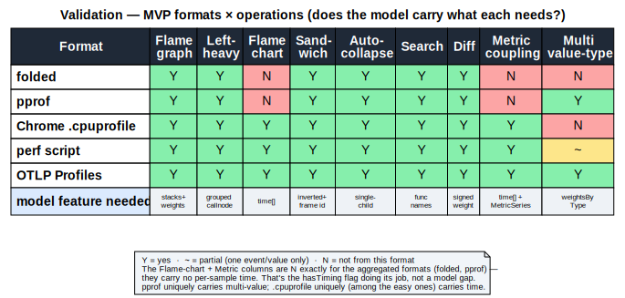

# Architecture

How the viewer is put together: the in-memory profile model, the derived render
structures, and the design principles the renderer follows.

> Diagrams: [`data-model-structure.svg`](./diagrams/data-model-structure.svg) (tables +
> relationships), [`data-model-validation.svg`](./diagrams/data-model-validation.svg)
> (formats × operations).

---

## Data model

One canonical model underpins every view (graph, chart, sandwich, diff, metrics, and
scale). Parsers normalize each input format into it; views read from it. The shape is an
interned **structure-of-arrays** plus a **prefix-tree** for stacks: every non-string
table stores integer indices, and aggregation happens at *render* time, never at ingest.

### Shared, interned tables (one per profile)

**stringTable** — `string[]`. All names/paths are interned; everything else stores `int`
indices into it.

**funcTable** (a source-level function) — parallel arrays, `length = #funcs`:

| column | type | notes |
|---|---|---|
| `name` | `int` → stringTable | |
| `file` | `int` → stringTable, or `-1` | |
| `line` | `int`, or `-1` | definition line |

Identity (for interning and cross-profile diff): **`name#file`**.

**frameTable** (a specific execution point; supports inlining):

| column | type | notes |
|---|---|---|
| `func` | `int` → funcTable | |
| `line` | `int`, or `-1` | call-site line |
| `inlineDepth` | `int` | `0` = real frame, `>0` = inlined |

Identity: **`func#line#inlineDepth`**.

**stackTable** (the prefix tree — the scale win):

| column | type | notes |
|---|---|---|
| `frame` | `int` → frameTable | |
| `prefix` | `int` → stackTable, or `-1` | parent stack node |

A full call stack is one `int` (the stack index); walk `prefix` to the root. Identity:
**`frame#prefix`** (interned, so identical stacks share a node).

### Per-thread

**Thread** — `name`, optional `tid`/`pid`, and a **samples** table:

| column | type | notes |
|---|---|---|
| `stack` | `int[]` → stackTable | stack at each sample |
| `weightsByType` | `{ ValueType → number[] }` | signed; multi-value |
| `time` | `number[]` | present **iff** `hasTiming` |

Weights are stored **per value-type**, so the value-type selector switches columns
instantly. Files that carry several values (e.g. pprof's `[samples, cpu_nanos]`) keep all
of them; a streamed source that can only afford one populates a single column — the shape
holds either way. Weights are **signed** so diff falls out for free (the baseline is
negative, merge-summed).

### Profile (container) + capability flags

```
Profile {
  stringTable, funcTable, frameTable, stackTable
  threads: Thread[]
  metrics: MetricSeries[]          // sibling time-series, aligned by timestamp
  capabilities: {
    hasTiming:   boolean           // samples carry time[] → flame chart + metric coupling
    weightTypes: ValueType[]       // e.g. SAMPLES, CPU_NANOS, ALLOC_BYTES, IO_BYTES
    isDiff:      boolean           // weights may be negative
  }
}
```

`ValueType` is extensible: `SAMPLES, CPU_NANOS, WALL_NANOS, ALLOC_BYTES, ALLOC_OBJECTS,
IO_BYTES`.

Inlined frames are representable via `inlineDepth` (inlined functions can render as their
own boxes, and diff keys stay stable); a loader may collapse inlines initially by setting
`inlineDepth = 0`, with no model change needed when full fidelity is added.

### Derived at load (not from the source)

**CallNodeTable** — the merged call tree for rendering, as **typed arrays** (`prefix`,
`func`, `depth` as `Int32Array`, plus `nextSibling`, `subtreeRangeEnd`). A
first-child-at-index+1 layout gives allocation-free traversal. Pruning and virtualization
operate here. It is rebuilt per view (top-down for the graph, inverted for sandwich,
grouped for left-heavy).

**MetricSeries** — `{ name, unit, time: number[], value: number[] }`, aligned to a
thread's time axis by timestamp. Multiple per profile.

### Every field justified by an operation

A field exists only if an operation needs it:

| Operation | Requires |
|---|---|
| Flame graph | stackTable + weights (any type) |
| Left-heavy | derived grouped CallNodeTable |
| Flame **chart** (time) | `samples.time` (`hasTiming`) + per-sample stacks |
| Sandwich | inverted CallNodeTable + frame identity |
| Auto-collapse | single-child detection on CallNodeTable |
| Search | func names (stringTable) |
| Diff | **signed** weights + frame identity across profiles |
| Metric coupling | `samples.time` + aligned `MetricSeries` |
| Value-type selector | `weightsByType` |

### Format × operation coverage



| Format | graph | left-heavy | chart | sandwich | collapse | search | diff | metric | multi-value |
|---|---|---|---|---|---|---|---|---|---|
| **folded** | ✅ | ✅ | ❌ | ✅ | ✅ | ✅ | ✅ | ❌ | ❌ |
| **pprof** | ✅ | ✅ | ❌ | ✅ | ✅ | ✅ | ✅ | ❌ | ✅ |
| **Chrome `.cpuprofile`** | ✅ | ✅ | ✅ | ✅ | ✅ | ✅ | ✅ | ✅ | ❌ |
| **perf script** | ✅ | ✅ | ✅ | ✅ | ✅ | ✅ | ✅ | ✅ | ⚠️ |
| **OTLP Profiles** _(planned, FG-027)_ | ✅ | ✅ | ✅ | ✅ | ✅ | ✅ | ✅ | ✅ | ✅ |

The first five rows are shipped parsers; **OTLP Profiles** is a *planned* importer (FG-027,
not yet in `src/`) — its row shows how the format will map onto the model once the parser
lands. The chart/metric columns are `❌` exactly for the aggregated formats (folded, pprof) —
they carry no per-sample time. That is the `hasTiming` flag working as designed: the UI
hides the chart tab when `hasTiming` is false. Every (implemented) format maps in; every
operation reads out or is explicitly unavailable.

### Invariants

- All indices are valid into their target table, or the `-1` sentinel.
- `stackTable.prefix` forms a forest rooted at `-1` (acyclic).
- Interning holds: identical `funcTable` / `frameTable` / `stackTable` key → same index.
- If `hasTiming`: `samples.time` is non-decreasing and `time.length == stack.length`.
- Single-source profiles: weights `≥ 0`. Diff profiles (`isDiff`): weights may be `±`.
- Every `ValueType` in `capabilities.weightTypes` has a column in every thread's
  `weightsByType`.
- `MetricSeries` shares the thread's time origin/unit.

### Out of scope for the model

- Remote/query concerns — a source adapter *emits* this model; it isn't part of it.
- Symbolication — assumed done upstream.
- Native address / symbol columns — a later seam (optional `address`/`nativeSymbol` on
  frameTable); not in the core.
- It models one workload's threads (+ aligned metrics), not an open-ended panel set.

---

## View modes & feature support

The viewer offers four flame modes plus an alternate radial rendering. Not every feature
applies to every mode — most of the differences fall out of the data model (e.g. a
time-ordered view needs per-sample timing). Internal mode keys are `chart` / `graph` /
`sandwich` / `diff`.

| Mode (label) | Internal key | Needs timing | Overview minimap + crop | Auto-collapse | Hover highlight | Detail panel |
|---|---|---|---|---|---|---|
| **Timeline** | `chart` | ✅ required | ✅ time window | — | all instances of fn | This / All / stack |
| **Aggregated** | `graph` | — | ✅ value-fraction | ✅ | ancestor↔descendant path | This / All / stack |
| **Sandwich** | `sandwich` | — | — | — | all instances of fn | This / All / stack |
| **Diff** | `diff` | — | ✅ value-fraction | — | ancestor↔descendant path | Δ only |

Common to all modes: regex **search + dim**, **zoom/focus** (Timeline crops a time span,
Aggregated/Diff focus a subtree, Sandwich re-centers on the focal function), the **value-type
(weight) selector**, and **semantic color / theming**.

- **Timeline** is offered only when the profile carries per-sample time (`hasTiming`); the
  UI hides it for aggregated formats (folded, pprof).
- **Auto-collapse** of boring single-child chains applies only to Aggregated.
- **Hover highlight** lights the full ancestor↔descendant call path in Aggregated/Diff; in
  Timeline/Sandwich it lights every instance of the hovered function instead.
- **Diff** shows per-node Δ in the detail panel (no All-Instances/stack breakdown).
- **Radial (sunburst)** is an alternate *rendering* of the Aggregated view (FG-039): same
  aggregated data as a radial layout, no minimap and no collapse.

---

## Rendering & design principles

The renderer is a single **Canvas 2D** surface (`getContext('2d', { alpha:false })`,
rAF-throttled, DPR-aware), with text drawn on the same canvas. The visual language
follows one governing rule:

> **Restyle anything that does *not* carry data — borders, the vertical (depth)
> treatment, color, motion-on-interaction. Never restyle the thing that does: horizontal
> width.** At every level, x-extent *is* the metric. That single line decides every
> visual question.

### Width is sacred

Any silhouette change that makes width ambiguous breaks the one thing a flame graph is
trusted for. Slanted or notched edges make a box's start/end ambiguous and break
left-edge alignment between a child and its place in the parent — a real containment cue
traded for a decorative one. An arrow/chevron implies flow, which is honest only where
the x-axis is time: reserve arrow shapes for the **time-ordered chart**, never the
aggregated graph (where left→right means nothing).

### Borderless — separate with gaps, not strokes

Boxes carry no stroke; separation comes from a ~1px background gap (pull each box's edge
in slightly so the background shows through). A gap is sharper and cheaper than a drawn
line and never competes with the fill. This only degrades gracefully alongside
**sub-pixel pruning** — you can't put a 1px gap on a 2px box — so borderless and pruning
are the same decision. Avoid bevels / inner highlights; stay flat and let gaps and fill
do the work.

### Vertical rhythm is free design space

Depth is ordinal — nobody measures box height — so the y-treatment is open. A consistent
row height reads as "clean" on its own. A barely-there luminance step between depth levels
separates rows with zero lines. Optional small touches (a hair of child/parent overlap;
≤1–2px top-corner rounding that's dropped below a width threshold) reinforce nesting
without touching width.

### Auto-collapse boring chains

A single-child chain where the child's weight is ~equal to the parent's (`a→b→c→d`, each
calling only the next) carries no branching information yet eats vertical space. Folding
it into one bar with an `(N)` badge is honest — the weights are identical, nothing is
lost — and de-clutters deep stacks. Requirements: an affordance for hidden depth (badge /
chevron) so a collapsed chain doesn't read as a leaf; layout stability so the user
doesn't lose their place; and a conservative heuristic that only folds near-equal-weight
single-child chains, never branch points.

### Interaction removes static load

Interactivity's real value is that it lets the resting state be calmer and denser: drop
labels on narrow boxes and reveal the full name on hover (the label never has to fit);
keep resting color intensity low and light up the **ancestor→descendant path** on hover
while dimming the rest. Follow overview → zoom → filter → details-on-demand. (Interaction
solves *exploration* density, not static-export density, so it pairs with the legibility
moves above rather than replacing them.)

### Color means something

The legacy default — a hash of the function name mapped to a red/orange/yellow ramp —
is both garish and informationally empty. The progression that fixes it:

| Scheme | Pretty? | Useful? |
|---|---|---|
| Random hash | ❌ | ❌ encodes nothing |
| Semantic / categorical (by module/package/language) | ✅ | ✅ groups related code |
| Value shading (darker/saturated = hotter) | ✅ | ✅ encodes the metric |
| Semantic hue + value shading | ✅ | ✅✅ two signals, no clutter |

Color hue encodes **module/package** (not a hash); intensity can encode the metric.
Palettes are low-saturation and legend-able. A genuinely good dark mode is the default
(this is a dev tool viewed in dark editors), and palettes should be colorblind-safe.
Diff uses a diverging scale: red = more in the comparison (regression), blue = less
(improvement), grey ≈ unchanged.

The principle throughout: **clarity, not decoration.** Gradients, drop-shadows, and 3D
bevels distort width perception and waste pixels; the best-looking flame graph is the one
where color carries signal and the type is readable — which is also the most useful one.

### Scale via "draw less"

Draw cost is viewport-bounded, not sample-count-bounded: sub-pixel subtree pruning caps
the number of drawn boxes at roughly width × depth regardless of profile size, and
hit-testing is a CPU scan of the boxes in the hovered row (depth derived from `y`). Deep
stacks (>~1000 levels) would add row-level vertical virtualization on the same
CallNodeTable.
